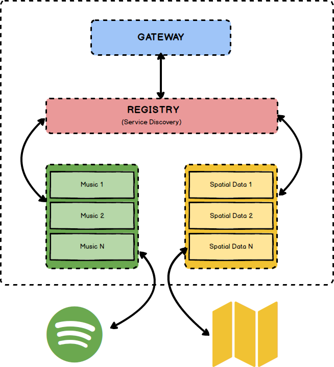

# iFood Backend Advanced Test

Create a micro-service able to accept RESTful requests receiving as parameter either city name or lat long coordinates and returns a playlist (only track names is fine) suggestion according to the current temperature.

## Business rules

* If temperature (celcius) is above 30 degrees, suggest tracks for party
* In case temperature is between 15 and 30 degrees, suggest pop music tracks
* If it's a bit chilly (between 10 and 14 degrees), suggest rock music tracks
* Otherwise, if it's freezing outside, suggests classical music tracks 

## Hints

You can make usage of OpenWeatherMaps API (https://openweathermap.org) to fetch temperature data and Spotify (https://developer.spotify.com) to suggest the tracks as part of the playlist.

## Non functional requirements

As this service will be a worldwide success, it must be prepared to be fault tolerant, responsive and resilient.

Use whatever language, tools and frameworks you feel comfortable to, and briefly elaborate on your solution, architecture details, choice of patterns and frameworks.

Also, make it easy to deploy/run your service(s) locally (consider using some container/vm solution for this). Once done, share your code with us.
 
# Solução

Para a solução do desafio proposto, foi desenvolvida uma pequena plataforna RESTfull baseada em microserviços, utilizando as seguintes técnologias:

* Java 8;
* Maven 3;
* Spring Framework
   * Spring Boot (2.0.2);
   * Spring Cloud (Finchley.RC1);
* Docker (18.05);

## Estrutura do Projeto

O projeto foi dividido em módulos, conforme o esquema abaixo:

    .
    ├── app                                   
    │   ├── ifood-test-architecture           # Módulo base que define pontos comuns entre os serviços.
    │   ├── ifood-test-cloud-gateway          # Serviço que trabalha como proxy e load balancer.
    │   ├── ifood-test-cloud-registry         # Serviço que trabalha como service discovery.
    │   ├── ifood-test-service-music          # Serviço responsável pela entrega de musicas.
    │   ├── ifood-test-service-spatial-data   # Serviço responsevel por entregadas dados geoespaciais.
    │   ├── docker-compose.yml                # Arquivo que faz a "Orquestração" dos serviços;
    │   ├── Dockerfile                        # Gera uma imagem base para conteineinerização do projeto.
    │   └── pom.xml
    └── README.md

A idéia por trás do solução, foi criar um micro ambiente esalável e tolerante a falhas (com algumas ressalvas para não deixar a solução muito complexa, como a não redundancia do serviços de gateway e registry), além de demostrar os conhecimentos técnicos em torno das técnologias citadas. Para tanto a seguinte arquitetura foi desenvolvida, de acordo com o esquema a seguir:

