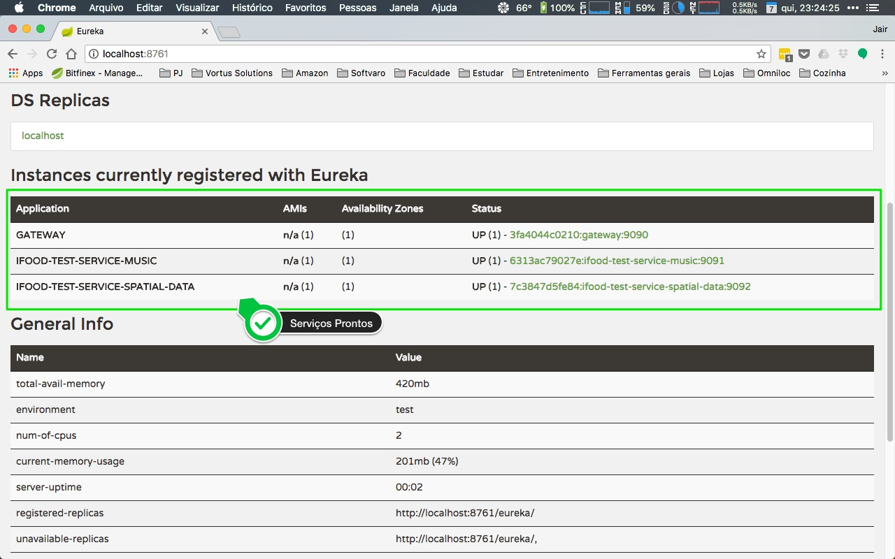
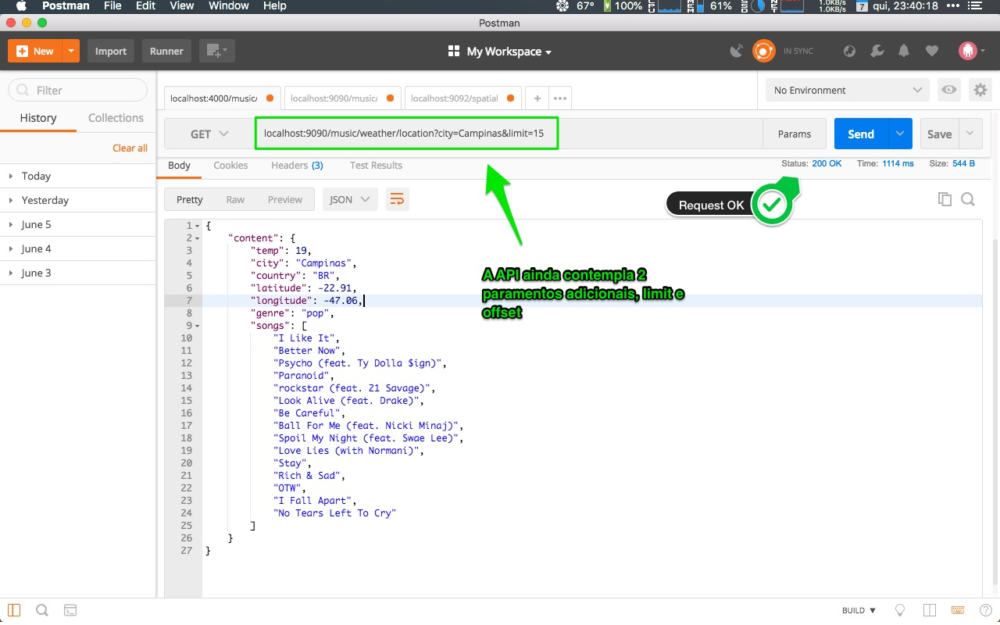

# iFood Backend Advanced Test

Create a micro-service able to accept RESTful requests receiving as parameter either city name or lat long coordinates and returns a playlist (only track names is fine) suggestion according to the current temperature.

## Business rules

* If temperature (celcius) is above 30 degrees, suggest tracks for party
* In case temperature is between 15 and 30 degrees, suggest pop music tracks
* If it's a bit chilly (between 10 and 14 degrees), suggest rock music tracks
* Otherwise, if it's freezing outside, suggests classical music tracks 

## Hints

You can make usage of OpenWeatherMaps API (https://openweathermap.org) to fetch temperature data and Spotify (https://developer.spotify.com) to suggest the tracks as part of the playlist.

## Non functional requirements

As this service will be a worldwide success, it must be prepared to be fault tolerant, responsive and resilient.

Use whatever language, tools and frameworks you feel comfortable to, and briefly elaborate on your solution, architecture details, choice of patterns and frameworks.

Also, make it easy to deploy/run your service(s) locally (consider using some container/vm solution for this). Once done, share your code with us.
 
# Solução

Para a solução do desafio proposto, foi desenvolvida uma pequena plataforna RESTfull baseada em microserviços, utilizando as seguintes técnologias:

* Java 8;
* Maven 3;
* Spring Framework
   * Spring Boot (2.0.2);
   * Spring Cloud (Finchley.RC1);
* Docker (18.05);

## Estrutura do Projeto

O projeto foi dividido em módulos, conforme o esquema abaixo:


    .
    ├── app                                   
    │   ├── ifood-test-architecture           # Módulo base que define pontos comuns entre os serviços.
    │   ├── ifood-test-cloud-gateway          # Serviço que trabalha como proxy e load balancer.
    │   ├── ifood-test-cloud-registry         # Serviço que trabalha como service discovery.
    │   ├── ifood-test-service-music          # Serviço responsável pela entrega de musicas.
    │   ├── ifood-test-service-spatial-data   # Serviço responsável por entregar dados geoespaciais.
    │   ├── docker-compose.yml                # Arquivo que faz a "Orquestração" dos serviços;
    │   ├── Dockerfile                        # Gera uma imagem base para conteineinerização do projeto.
    │   └── pom.xml
    └── README.md

A idéia por trás do solução, foi criar um pequeno ambiente escalável e tolerante a falhas **(com algumas ressalvas para não deixar a solução muito complexa, como a não redundancia do serviços de gateway e registry)**, além de demostrar os conhecimentos técnicos em torno das técnologias citadas. Para tanto, a seguinte arquitetura foi desenvolvida, de acordo com o esquema a seguir:


### Módulo Gateway

Como a solução proposta pode apresentar diversas instacias de microserviços rodando em diferentes hosts ou portas, foi feita a opção por implementar um módulo de **Gateway**, que funciona basicamente como meio de entrada e roteamento para um determinado microserviço, respeitando as rotas configuradas no arquivo `application.yml`. Por fim, o objetivo é que todo o trafego entre a `plataforma` e o `client`, passe pelo módulo de Gateway.

Como exeplificado no esquema anterior, o gateway irá receber a requisição e consultar no `Service Discovery`, neste caso o serviço chamado `Registry`, por qual instancia de serviço coresponde à aquela determinada rota.

Para este exemplo, está sendo utilizado a solução do pacote [Netflix OSS](https://netflix.github.io/) , chamado [Zuul](https://github.com/Netflix/zuul) como implementação do módulo de gateway.

### Módulo Registry (Service Discovery)

O `Service Discovery` é um dos principios aplicados em arquiteturas basedas em microserviços, cujo o objetivo é identificar e registrar informações das diferentes instancias de serviços dentro da aquitetura, como por exemplo, quais são os endereços de `hosts` e `porta`, nos quais esses serviços estão respondendo, bem como o seu `status`.

Para esta solução, o conceito se aplica devido as multiplas instacias dos serviços de `music` e `spatial-data`, que podem assumir endereços de IP e Porta dinamicamente, o que pode justificar a implementação desse recurso.

Neste caso, o [Eureka](https://github.com/Netflix/eureka), que também faz parte da Stack de soluções da `Netflix OSS`, é utilizado como implementação de `Service Discovery`.

### Módulo Music

Este é o serviço responsável por receber a requisição do cliente, por meio de uma API RESTfull, neste caso uma sugestão de musicas de acordo com o clima e localização, para isso, o serviço se comunica com serviço de dados geoespaciais, chamado de `spatial-data`, que tem como provedor de dados o `OpenWeatherMaps` e com o `Spotify`, que é o provedor de acesso as musicas, devolvendo então uma lista de musicas de acordo com o gerero musical e a temperatura do local em questão.

O fluxo para realizar essas operações pode passar pelas seguintes API(s):
* localhost:9090/music/weather/location?city=Timbuktu
* localhost:9090/music/weather/location?latitude=71.7069&longitude=-42.6043

Sendo que, ao realizar uma dessas requisições através do método `HTTP GET`, ocorre os seguintes passos:

    1 - O serviço "music" solicita a temperatura do local informado para o serviço "spatial-data";
    2 - Ao receber a resposta o servico "music", por meio das regras de negócio estabelecidas, determina o genero musical;
    3 - Que em seguida, solicita ao "Spotify", uma lista de musicas para o genero escolhido;
    4 - E, por fim, faz a agregação dos dados necessários, devolvendo uma lista de musicas sugeridas para o cliente.

> Spotify: [Search Endpoint](https://developer.spotify.com/documentation/web-api/reference/search/search/)

**Exemplo de Retorno:**

``` json
{
  "content": {
    "temp": -2.47,
    "city": "Greenland",
    "country": "GL",
    "latitude": 71.71,
    "longitude": -42.6,
    "genre": "classical",
    "songs": [
      "Unaccompanied Cello Suite No. 1 in G Major, BWV 1007: I. Prélude",
      "Sonata No. 14 \"Moonlight\" in C-Sharp Minor\", Op. 27 No. 2: I. Adagio sostenuto",
      "Suite bergamasque: Suite bergamasque: III. Clair de lune. Andante très expressif",
      "Requiem: Lacrimosa",
      "Opening",
      "Gnossienne No.1 (Arr. Kleynjans)",
      "Berceuse In D Flat, Op.57",
      "Piano Concerto No. 21 in C Major, K. 467 \"Elvira Madigan\": II. Andante",
      "Nocturne, Op. posth. in C-Sharp Minor: Lento",
      "Claire De Lune"
    ]
  }
}
```

Para efetuar as requisições, está sendo utilizado o [OpenFeign](https://github.com/OpenFeign/feign), como `client http`, sendo o responsavel por se comunicar e consumir as demais API(s).

### Módulo Spatial-Data

Este é o serviço responsável por prover as informações pertinentes ao clima de acordo com a localização informada. Ele trabalha independente do módulo `music` e pode ser utilizado diretamente através de suas API(s):
* localhost:9092/spatial-data/weather/city?name=Campinas
* localhost:9092/spatial-data/weather/coordinates?lat=37.39&lon=-122.09

O fluxo de operação, diferente do serviço de `music`, não tem complexidade que corresponde as regras de negócio, seu trabalho fica apenas para na consulta de informaçõe no provedor `OpenWeatherMaps` e no resumo dessas desses dados, afim de facilitar seu uso para aquilo que é realmente pertinente para a solução. Abaixo, segue o resultado ao consultas uma das duas API(s) anteriores.

> OpenWeatherMaps: [API](https://openweathermap.org/api)

**Exemplo de Retorno**

```json
{
  "content": {
    "cityName": "Campinas",
    "country": "BR",
    "latitude": -22.91,
    "longitude": -47.06,
    "temp": 19,
    "tempMin": 19,
    "tempMax": 19
  }
}
```

Para as chamadas REST tambem é utilizada a implementação do [OpenFeign](https://github.com/OpenFeign/feign)

### Módulo Architeture

Se trata apenas de um módulo base para os demais microserviços, contento as dependencias necessários para o funcionamento basico do `Spring Boot` e `Spring Cloud`, alem dem alguns recursos e configurações basicas que se não implementados neste módulo poderiam se tornar redundantes em varios microservições.

### Sistema de Circuit Breaker

Em uma aplicação distribuída é comum que haja chamadas entre diversos servidores na rede. Diferente da chamada em memória, as chamadas remotas podem falhar ou ficarem pendentes se o host destino estiver indisponível até que um tempo limite seja atingido.

Vale lembrar que a solução vem com o pattern de circuit breaker implementado em todas as chamadas `HTTP` que estão sendo realizadas pelo `Feign`. Logo, caso uma requisição começar a falhar, neste caso uma resposta padrão é enviada, evitando assim que o cliente não receba nada, neste ponto é digno de nota, ressaltar que esse não é o comportamento padrão da solução de circuit breaker, já que o "correto" seria devolver alguma informação em cache ou um erro conhecido, alem de armazenar métricas informando o local da falha. Contudo foi uma opção não fazer essa implementação tão profunda para não adiconar maior complexidade a solução.

Para essa implementação está sendo utilizado o [Hystrix](https://github.com/Netflix/Hystrix), da `Netflix`.

### Testes

Como os testes não fazem parte explicita no requisito desse desafio, foram realizados testes unitários simples que correpondem as regras de negócio da aplicação, nada além disso.

# Executando a Solução

> Finalmente... :D

Graças ao docker a execução é muito simples... Basta acessar via linha de comando a pasta `app` e executar o comando:

```shell
> docker-compose -p ifood up
```

Isso irá gerar uma imagem com todas as dependencias do projeto e em seguida iniciará todos os serviços necessários.
> A primeira execução pode levar pelo menos **5 minutos** para finalizar a build devido ao download de dependencias do maven.

Caso queira subir mais de uma instancia de um dos serviços `music` ou `spatial-data`, execute o comando da seguinte forma:

```shell
> docker-compose -p ifood  up --scale music=2 spatial-data=2
```

Esse comando deve subir instancias de ambos os serviços de acordo com o valor especificado na propriedade `--sacale [SERVICE=NUBER]`. Lembro que os serviços de cloud (Gateway e Registry), não foram configurados para ter mais de uma instância, então caso o faça, deve ocorrer problemas na execução.

> Lembre-se de ter o [Docker](https://docs.docker.com/install/) e o [Docker Compose v3+](https://docs.docker.com/compose/install/) instalado na maquina que irá executar a solução.

## Chegando se os serviços estão em execução

Para isso acesse seu navegador e busque pela url `localhost:8761`, caso consiga acessa-la, a pagina do Eureka deve ser exibida, como mostra a imagem a seguir:



Se tudo estiver `OK` os serviços deve aparecer como na imagem.

## Fazendo a requisição na API

Para realizar a requisição na API, foi utilizado o Postman. A solicitação é muito simples, basta escolher umas das URL(s), da API de `music`, por meio de um `HTTP GET`.

    localhost:9090/music/weather/location?city=Timbuktu
    localhost:9090/music/weather/location?latitude=71.7069&longitude=-42.6043

Como mostra a próxima imagem:



## Obrigado

> Vitória... :P

Foi um desafio bem elaborado, que me fez pensar em uma solução na integração entre API(s) e serviços baseado na arquitetura de microserviços. Acredito que essa solução satisfaça as diretrizes do requisito do desafio.
Agradeço a oportunidade.

## Referências:
* Docker - https://docs.docker.com/install/overview/
* Docker Compose - https://docs.docker.com/compose/overview/
* Eureka - https://github.com/Netflix/eureka
* Hystrix - https://github.com/Netflix/Hystrix
* Netflix OSS - https://netflix.github.io/
* OpenFeign - https://github.com/OpenFeign/feign
* OpenWeatherMaps - https://openweathermap.org/
* Spring Boot - https://spring.io/projects/spring-boot
* Spring Boot Docs - https://docs.spring.io/spring-boot/docs/2.0.2.RELEASE/reference/htmlsingle/
* Spring Cloud - https://projects.spring.io/spring-cloud/
* Spring Cloud Docs - http://cloud.spring.io/spring-cloud-static/Finchley.RC2/single/spring-cloud.html
* Spring Cloud Netflix - https://cloud.spring.io/spring-cloud-netflix/
* Spotify - https://developer.spotify.com/
* Zuul - https://github.com/Netflix/zuul